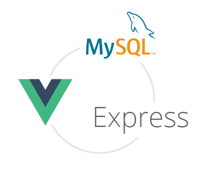
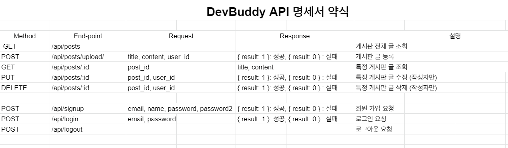
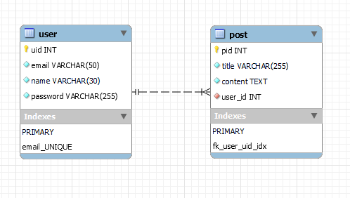

# Dev Buddy

    👨‍💻👩‍💻 개발 스터디 모집 게시판 만들기

### ♻ 기술 스택

### 💬 설계

### 📌 TODO

- [x] DB - MySQL로 변경
- [x] 테이블 설계
- [x] ERD 작성
- [x] 로그인 상태 유지 (클라이언트, 서버)
- [ ] 네비게이션 가드 적용 (클라이언트)
- [ ] 기본 CRUD 쿼리문 작성
