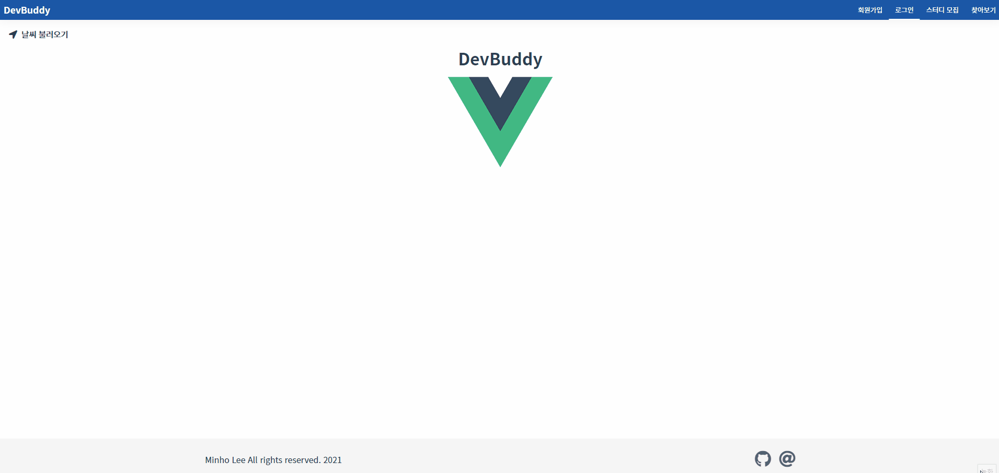

# Dev Buddy

    👨‍💻👩‍💻 개발 스터디 모집 게시판 만들기

### ♻ 기술 스택


### 💬 설계


### 현재까지 구현된 기능들



- [x] 로그인/ 로그아웃/ 로그인 유지
- [x] 회원 정보 전역 상태 관리
- [x] 새로고침 시 Vuex 스토어 초기화 문제
- [x] 컴포넌트 별 기본 폼 작성
- [x] 폼 유효성 검사 (서버)
- [x] 현재 위치 기반 날씨 정보 가져오기
- [x] 기본 쿼리문 작성 (생성, 조회)

### 📌 TODO

- [ ] 네비게이션 가드 분기 처리 (클라이언트)
- [ ] 폼 유효성 검사 (클라이언트)
- [ ] 기본 쿼리문 작성 (수정, 삭제)

### ‼ 로컬 테스트 방법

```bash
// Server
$ yarn server
```

```bash
// Client
$ yarn client
```

```bash
// Dev
$ yarn dev
```
